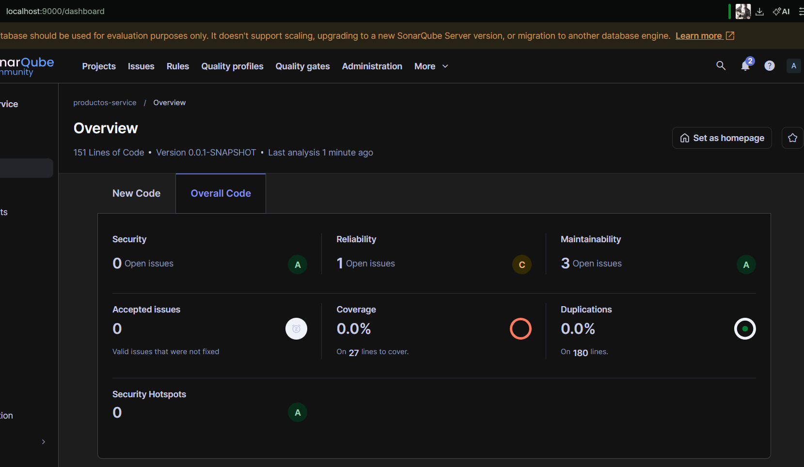
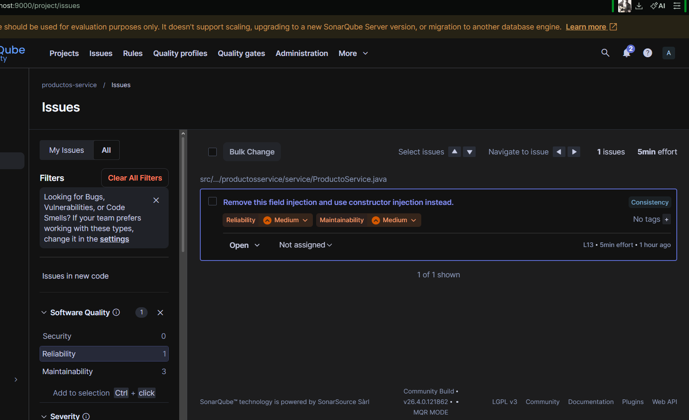

# Productos Service - Analisis SonarQube (Post 1)

## Objetivo
Ejecutar el primer analisis estatico con SonarQube y documentar los hallazgos del
dashboard.

## Estado inicial del analisis
| Categoria | Cantidad | Rating |
|-----------|----------|--------|
| Bugs | 1 | C |
| Vulnerabilidades | 0 | A |
| Code Smells | 3 | A |
| Cobertura | 0.0% | - |

## Hallazgos principales identificados
### Bug 1: Retorno null en buscar()
- Archivo: src/main/java/com/universidad/productosservice/service/ProductoService.java,
	linea 45-46
- Descripcion: `buscar` retorna null cuando el id no existe y puede causar
	NullPointerException en los consumidores.
- Severidad: Major

### Code Smell 1: Inyeccion en campo
- Archivo: src/main/java/com/universidad/productosservice/service/ProductoService.java,
	linea 13-14
- Descripcion: uso de `@Autowired` en campo y nombre generico `repo`.

### Code Smell 2: Comparacion de cadena vacia con equals
- Archivo: src/main/java/com/universidad/productosservice/service/ProductoService.java,
	linea 20
- Descripcion: se recomienda `isBlank()` para validar null y espacios.

### Code Smell 3: Logica de negocio en entidad JPA
- Archivo: src/main/java/com/universidad/productosservice/domain/Producto.java,
	linea 19-29
- Descripcion: `getEstado()` incluye reglas de negocio dentro de la entidad.

## Capturas del dashboard

## Ejecucion del analisis
1. Levantar SonarQube en Docker (puerto 9000).
2. Ejecutar `mvn clean verify`.
3. Ejecutar `mvn sonar:sonar -Dsonar.token=TU_TOKEN`.

## Prerrequisitos
- JDK 21, Maven 3.9+ y Docker Desktop.
- SonarQube disponible en http://localhost:9000.
